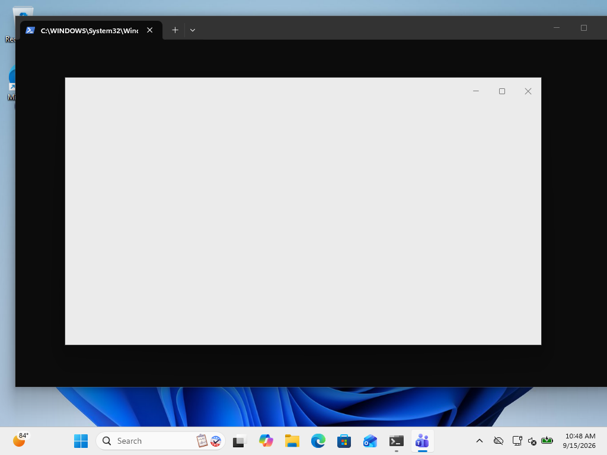
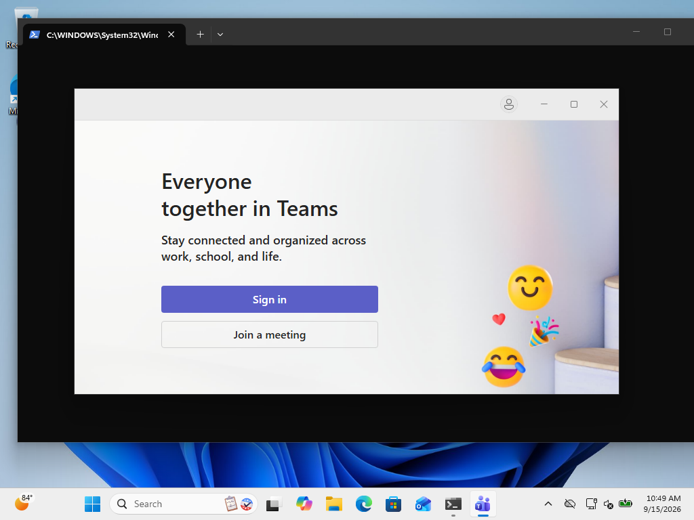

<!-- doc-review 2026-09-15: three-lens gate (hiring-manager / principal-engineer / editor) + deslop pass. REDs fixed: evidence screenshots shipped (evidence/), mechanism claim downgraded to observed behavior, "not achievable" hedged to tested result, boot->sign-in normalized, glossary+TOC+file tree added. -->
# Case study: Stopping new Teams from launching at sign-in — what works, what doesn't, and why

> **In three sentences:** Microsoft Teams starts itself in the background every time
> users sign in to Windows, and on many machines it is the heaviest thing happening
> at that moment. We built and tested a reversible, documented way to stop that
> automatic start. We also tested six ways to *delay* the start instead of stopping
> it — the approach that is usually asked for first — and found none that works
> without showing a Teams window on screen; this document is that evidence.

**Audience:** endpoint engineers (Intune/ConfigMgr) and their stakeholders.
Technical terms are expanded on first use and collected again in the
[Glossary](#glossary-terms-used-in-this-document). One vocabulary note: this
document says **sign-in** (also called logon) for the moment a user reaches their
desktop — most people say "boot," but Teams does not start at power-on; it starts
when the user's session begins.

**Tested on:** Windows 11 24H2 (production device, co-managed) and Windows 11 25H2
build 26200 (lab VM). New Teams — the `MSTeams_8wekyb3d8bbwe` app package (an
**MSIX** is the Windows app-package format used for Store and modern apps) —
versions 26213–26225. Every claim below is tied to a live test, a screenshot in
the `evidence/` folder, or a cited source. Where we could not verify something,
the document says so.

**Contents:** [TL;DR](#tldr) · [1. How Teams starts itself](#1-how-new-teams-actually-starts-itself) · [2. Disabling](#2-disabling-what-works-what-silently-doesnt) · [3. The delay question](#3-the-delay-question-possible-but-not-quietly) · [4. Fleet deployment](#4-fleet-deployment-shape) · [5. How we tested](#5-how-we-tested-reproduce-it) · [6. What we could not find](#6-what-we-could-not-find-and-what-we-did-not-test) · [7. References](#7-references) · [Glossary](#glossary-terms-used-in-this-document)

---

## TL;DR

| Goal | Mechanism | Verdict |
|---|---|---|
| Stop Teams launching at logon | Disable **both** autostart vectors (registry, user scope) | **Works. Zero processes, zero windows at boot. Reversible.** |
| Delay Teams launch by N minutes — quietly (tray only) | — | **No reliable mechanism.** The app's own `msteams_autostarter.exe` helper launches quietly but is *gated on the native autostart pipeline having already run that logon* — exactly what a delay design disables. Tested 6 ways: 1 success (in the shadow of a same-logon native fire), 5 no-ops including a fresh boot at logon+2 min. |
| Delay via AUMID activation (`shell:AppsFolder\…`) | Disable both vectors + scheduled task | **Pops the Teams window** (foreground sign-in page, persistent). Only acceptable if a window at logon+2 min is tolerable. |

The recommended fleet answer is the first row: an Intune Proactive Remediation
(detection + remediation, user context) that disables both vectors. If the
requirement is strictly "delay, zero disruption," that requirement is not
deliverable with current Windows/Teams mechanisms — §3 documents every attempt
and the gating evidence, which is what you bring to the escalation conversation.

---

## 1. How new Teams actually starts itself

This is the part nearly every forum answer gets wrong. New Teams registers
**two independent autostart vectors** — a *vector* here means one self-start
mechanism; Teams has two, and disabling only one leaves the other launching
Teams at sign-in anyway.

### Vector 1: the packaged startup task

The MSIX manifest declares a startup task:

```xml
<desktop:StartupTask TaskId="TeamsTfwStartupTask" Enabled="true" DisplayName="Microsoft Teams" />
```

Its state lives in:

```
HKCU\Software\Classes\Local Settings\Software\Microsoft\Windows\CurrentVersion\AppModel\
    SystemAppData\MSTeams_8wekyb3d8bbwe\TeamsTfwStartupTask
    State = DWORD
```

The `State` values are Microsoft-documented (Microsoft Learn, *Install Teams on
virtualized devices* → *Teams autostart*):

| Value | Meaning |
|---|---|
| 0 | Disabled |
| 1 | DisabledByUser (only the user can re-enable) |
| 2 | Enabled (by the user) |
| 3 | DisabledByPolicy |
| 4 | EnabledByPolicy |

This is what the Task Manager *Startup apps* toggle and Settings → Apps → Startup
write. (`HKCU` in these paths means HKEY_CURRENT_USER — the part of the Windows
registry that belongs to the signed-in user, which is why no admin rights are
needed to change it.)

### Vector 2: a classic Run entry

```
HKCU\Software\Microsoft\Windows\CurrentVersion\Run
    Teams = "C:\Users\<user>\AppData\Local\Microsoft\WindowsApps\MSTeams_8wekyb3d8bbwe\ms-teams.exe" msteams:system-initiated
```

Gated by:

```
HKCU\Software\Microsoft\Windows\CurrentVersion\Explorer\StartupApproved\Run
    Teams = REG_BINARY (12 bytes)
```

The 12-byte value is the standard Task Manager disable format: first byte even
(`02`) = enabled, odd (`03`) = disabled; bytes 5–12 are the FILETIME of the last
toggle. An absent `StartupApproved` value means **enabled by default**.

On both test machines this Run entry was written by the app itself (zero
FILETIME, never user-toggled) — so a device can have *both* vectors live
simultaneously.

> **Field note:** the admin-facing `HKLM\SOFTWARE\Microsoft\Windows\CurrentVersion\
> Policies\System` values (`EnableFullTrustStartupTasks`, `SupportFullTrustStartupTasks` = 0)
> also disable autostart, with the checkbox greyed out (State reports 3). We cite this
> from the Microsoft doc but did not lab-test it: it is machine-wide and hits **all**
> packaged desktop apps, not just Teams.

---

## 2. Disabling: what works, what silently doesn't

### The disable recipe (tested, reversible)

1. Vector 1: `State` → `1` (DisabledByUser).
2. Vector 2: create the `StartupApproved\Run` value named `Teams` with first byte
   `03` + current FILETIME. **Do not delete the Run value** — flag-disable is
   loop-proof, deletion invites rewrites.

Both changes are exactly what Task Manager writes when a user flips the toggles,
so they are user-reversible and never break the app.

### Three findings that break naive scripts

**Finding 1 — one vector is not enough.** With `State=1` but the Run entry live,
Teams still launched at logon (witnessed: `ms-teams` processes 2.5 minutes after
boot, interactive logon confirmed via `quser`). Any remediation touching only the
documented startup-task key leaves roughly half the job done — and you won't
notice unless you watch processes at the next logon.

**Finding 2 — the `StartupApproved\Run` key may not exist yet.** On the clean lab
image the whole key path was absent; a `Set-ItemProperty` against it fails with
`PathNotFound`. Create the key path first. (This bug bit our first remediation
attempt, which is how we know.)

**Finding 3 — Teams reconciles its own registration.** After booting with the
startup task disabled, the running Teams app deleted its own Run value. Two
consequences: the app *sometimes cleans up after you*, and your detection logic
must tolerate an absent Run value plus an orphaned `StartupApproved` flag instead
of treating "Run value missing" as fixed.

### What it looks like when it works

Both vectors disabled → reboot → interactive logon → **zero** `ms-teams` processes
at the 2.5-minute mark, on both test machines. Re-enabled → same test →
`ms-teams` running. Registry values held across reboot in every run.

---

## 3. The delay question: possible, but not quietly

Windows gives packaged startup tasks an ON/OFF switch. There is **no delay knob**
— the State enum is the entire surface. (Services have delayed-autostart; that is
a boot-queue mechanism and does not apply to logon launches.) So a delay has to
be built: disable the native paths, then launch Teams yourself from a scheduled
task with a Logon trigger and a delay (`PT2M` — the task scheduler's ISO-8601
format for "2 minutes"). The task fires exactly on time — that part works.

The entire difficulty is the task's *action*. We tested four:

| Task action | Result |
|---|---|
| Execute the native command: `ms-teams.exe msteams:system-initiated` | **Silent no-op that reports exit 0.** The task logs success; Teams never starts. The alias only launches Teams when the OS's own launch machinery delivers it (Explorer processing the Run entry, or the startup-task helper); we could not make Task Scheduler deliver it, and the exact gate condition is untested. This is the nastiest trap in the space: the remediation looks successful and is not. |
| `explorer.exe shell:AppsFolder\MSTeams_8wekyb3d8bbwe!MSTeams` | No launch. |
| `powershell Start-Process 'msteams:'` (protocol) | No launch. |
| `powershell Start-Process 'shell:AppsFolder\MSTeams_8wekyb3d8bbwe!MSTeams'` | **Teams starts within seconds.** (ShellExecute path. The `shell:AppsFolder\<id>` string is an **AUMID** — Application User Model ID, the identifier Windows uses to launch a packaged app; Teams' is `MSTeams_8wekyb3d8bbwe!MSTeams`.) |

So the only working delayed launcher is the ShellExecute/AUMID one.

### Why the obvious delay fails: AUMID activation pops the window

ShellExecute activation of the AUMID is, from the app's point of view, identical
to the user clicking the Teams icon. We captured the screen through the delayed
launch on a live desktop (scheduled-task screenshot loop, 30 frames across 3
minutes):

- +6s: a Teams window appears (white pre-render frame) with its own taskbar button
- +60s and +180s: the full **sign-in window, in the foreground, unchanged** —
  focus stolen, sitting over the desktop





If a Teams window two minutes after logon is acceptable, that variant is
mechanically solid (the timer is exact; the task fired at logon+2:00 in every
run). For a zero-disruption requirement, it isn't.

### Finding the quiet signal: audit what native autostart actually does

The quiet behavior users know from native autostart is delivered by an argument.
We proved it with process-creation auditing (event 4688 with command lines —
`auditpol /set /subcategory:"Process Creation" /success:enable` plus the
`ProcessCreationIncludeCmdLine_Enabled` policy value), which caught both launch
paths with parent and command line, race-free:

| Launch | Parent chain | Command line |
|---|---|---|
| Native, Run vector | `explorer.exe` | `ms-teams.exe msteams:system-initiated` |
| Native, startup-task vector | `sihost.exe` → **`msteams_autostarter.exe`** | `ms-teams.exe msteams:system-initiated` |
| Our delayed task (AUMID) | task → `powershell` → `explorer.exe` | `ms-teams.exe` — **no arguments** |

Same executable, different command line, different behavior: the quiet signal is
`msteams:system-initiated` delivered **at process creation** by the OS's own
launch machinery. It is not a registry value the app consults, so it cannot be
forged after launch, and Task Scheduler's `CreateProcess` cannot deliver it
(the alias no-ops with a false exit 0).

### The helper dead end: gated on the very pipeline you disable

The audit exposed `msteams_autostarter.exe` — the helper the startup-task vector
runs. Executing it directly launched Teams quietly (tray, no window, no focus
steal), which looked like the delayed-quiet answer. It is not. Six attempts,
one environment each:

| Attempt | Context | Result |
|---|---|---|
| Direct run, +5 min into a boot whose native autostart fired at +1 min | native pipeline ran this logon | **Launched quietly** |
| Task-fired, same logon, later | native ran earlier | no-op (exit 0, nothing) |
| Wrapper task, same logon, later | native ran earlier | no-op |
| Direct run, same logon, +100 min | native ran earlier | no-op (120 s watched) |
| **Fresh boot, wrapper task at logon+2 min** | **no native fire — vectors disabled** | **no-op (exit 0, nothing — 5.5 min watched)** |
| Fresh boot control, native enabled | native fired at logon | Teams launched at logon |

Pattern: the helper only functions in a logon where the native autostart
pipeline already ran — precisely the thing a delay design disables. The single
success was riding that pipeline's coattails. Conclusion, after six attempts
across fresh boots and both delay mechanisms: **we could not achieve a quiet
delayed start by any mechanism we tested.** The helper's exact gate condition is
unknown — it is an undocumented binary — so we state this as our result, not as
a proof of impossibility. The practical choice is binary: native autostart
(quiet, at sign-in) or disabled (nothing at sign-in) — with AUMID activation as
the only way to put Teams on a timer, at the cost of a popped window.

### The AUMID delay: mechanically solid, visibly disruptive

If a Teams window two minutes after logon is acceptable to the business, the
delayed task works exactly as specified (fired at logon+2:00 in every run,
exit 0, Teams running seconds later). For a zero-disruption requirement, it
fails on the screenshots — and that evidence is what you show whoever owns the
"just delay it" expectation.

---

## 4. Fleet deployment shape

**Recommendation:** an Intune Proactive Remediation, user context, daily
cadence, that:

1. Sets `TeamsTfwStartupTask\State = 1`.
2. Creates `StartupApproved\Run\Teams` as a 12-byte binary, first byte `03` +
   FILETIME (create the key path — it is absent on clean machines).
3. Re-runs daily, re-disabling anything an update or settings change re-enabled.

**Detection:** compliant when `State = 1` **and** (`Run` value absent **or** its
StartupApproved flag byte is odd — the app deletes the Run value itself
sometimes; don't require it to exist) **and**, in Delay mode, the scheduled task
exists (the kit's `detect_delay_drift.ps1` implements exactly this check). Kill
running `ms-teams` processes only if policy allows — not required for the next
sign-in to be clean.

**If the requirement is "delay, not disable":** §3 is the evidence that this is
not currently deliverable without disruption — six tested approaches, each with
its failure mode documented. The decision that goes up the chain is a choice
between three honest options: disable (this kit), accept a popped window at
logon+N (AUMID task, works mechanically), or leave Teams as-is. What does not
exist is the quiet delay the requirement imagines; that is a Microsoft feature
request, not a deployment task.

**Why daily:** Teams updates and in-app setting changes can re-enable autostart.
We did not characterize every re-enable trigger (updates especially); a daily
remediation makes that unknown irrelevant. Both test machines held state across
reboots and across app launches, but updates were not exercised.

The kit ships both shapes as one idempotent deployer: `deploy_teams_autostart.ps1`
(`-Mode Disable`, the default) and `-Mode Delay -DelayMinutes N` for the AUMID
variant with its window trade-off; `detect_delay_drift.ps1` is the mode-aware
detection counterpart.

**Sizing the win:** the boot impact is real — `ms-teams` plus a dozen
`msedgewebview2` processes (≈450–700 MB working set on the lab VM, shared runtime)
spawning inside the first minutes of logon. But before/after should be *measured*
in your environment (Task Manager startup impact, or your endpoint analytics
tool of choice), not asserted.

---

## 5. How we tested (reproduce it)

Rig: a Windows 11 25H2 Hyper-V VM (checkpoint taken before any mutation), user-
scope registry changes only, and a strict arm structure:

| Arm | Vectors at logon | Observed outcome |
|---|---|---|
| A (control) | both enabled | `ms-teams` ×2 running 2.5 min post-boot |
| A′ (half) | task disabled, Run live | **Teams still launched** — single-vector failure witnessed |
| B (fix) | both disabled | **zero Teams processes**, same window, same logon path |
| C (delay, AUMID) | both disabled + delayed task | task fired exactly at logon+2:00; **sign-in window popped** (screenshot evidence in `evidence/`) |
| D (delay, helper) | both disabled + `msteams_autostarter.exe` | 1 success in a same-logon native-fire shadow; **5 no-ops since, incl. fresh boot at logon+2 min** — gated on the native pipeline |

Method details worth stealing:

- **Interactive logon matters.** Startup tasks fire at interactive logon; verify
  with `quser` (console session, Active) before reading results.
- **Window claims need pixels.** Our first pass used `Get-Process`
  `MainWindowTitle` polling and concluded "no window." Screenshots proved a
  full window was up the whole time — an unrendered WebView2 window has no
  matching title. If the question is "does the user see something," screenshot
  the desktop; titles lie.
- **Capture GDI in the user session.** `CopyFromScreen` fails ("handle is
  invalid") from remote-management sessions. Run the capture as a scheduled task
  with an Interactive principal in the user's session.
- **Auto-logon** (registry `AutoAdminLogon` or Sysinternals Autologon) makes the
  A/B boots fully hands-off.

---

## 6. What we could NOT find, and what we did not test

Stated plainly, because publishable does not mean perfect:

- `msteams:system-initiated` and `msteams_autostarter.exe` are undocumented. The
  argument's quiet effect and the helper's gating were characterized
  empirically; the helper's exact gate condition is unknown — only its
  dependence on the native pipeline having run that logon.
- One lesson earned twice in this investigation: **window claims need pixels.**
  `MainWindowTitle` polling missed an unrendered WebView2 window entirely and
  produced a false "no window" verdict that screenshots overturned. Also:
  Direct-remoting sessions cannot capture the desktop (`CopyFromScreen` fails
  with "handle is invalid") — run capture as an Interactive scheduled task in
  the user session.
- The machine-wide policy lever (Section 1 field note) is doc-cited, not lab-tested.
- Update-driven re-enable of autostart: untested; cadence covers it.
- Signed-in-user behavior: our test machines had Teams unsigned-in; a signed-in
  pilot is the clean way to close this for the disable variant.
- Whether a sub-second splash precedes the window at +6 s: not resolvable at
  3-second capture granularity, and irrelevant — the window that follows is
  disqualifying anyway.

## 7. References

- Microsoft Learn — *Install Teams on virtualized devices* → *Teams autostart*
  (State enum, policy values, VDI roaming notes). Note: this page has been
  restructured into the VDI 2.0 content; the autostart section circulates in
  archived form.
- Task Manager disable format (12-byte `StartupApproved` values): standard
  Windows behavior, also visible in Sysinternals *Autoruns* coverage of ASEPs.
- Community threads (WinAdmins and similar) reference the `TeamsTfwStartupTask`
  key — typically with the State=1 suggestion and, in our sample, without the
  Run-vector pairing or boot-logon receipts. That gap is why this case study
  exists.
